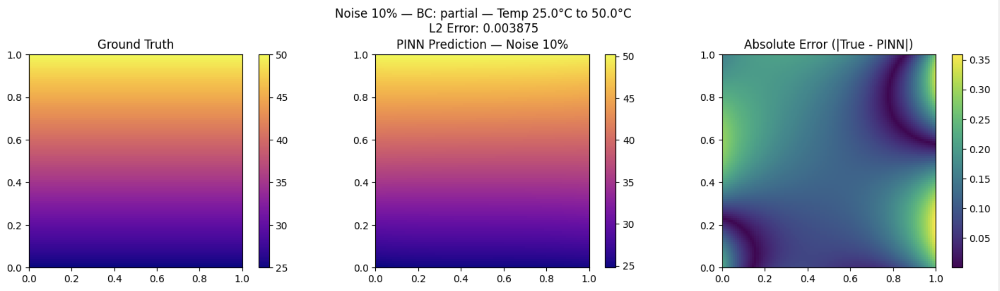
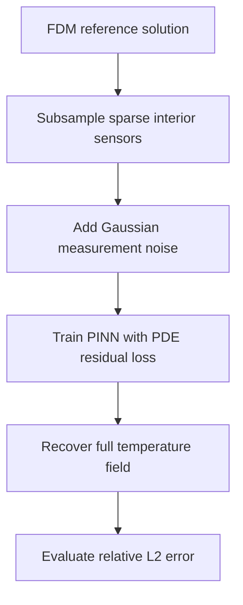
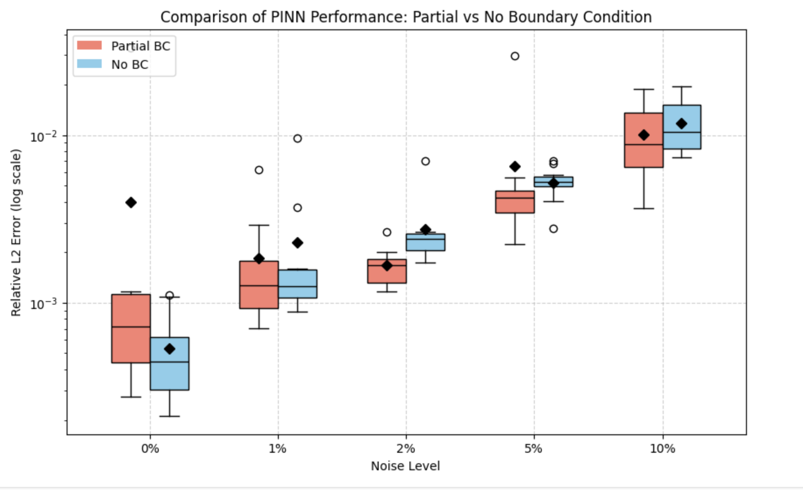

# Physics-Informed Neural Networks for Robust Reconstruction of the 2D Laplace Equation

This repository studies whether **Physics-Informed Neural Networks (PINNs)** can reconstruct a 2-dimensional Laplace temperature field from varying grid densities, boundary conditions, and noise levels.  The research question is whether a neural network can recover an entire incomplete-boundary temperature field from only sparse measurements of sensors. The experiment is framed as an inverse problem for the Laplace equation, using a finite difference method (FDM) to solve the forward problem to get ground truth, and evaluating PINN reconstructions across different sensor density, boundary conditions, and different Gaussian measurement noise level.



**Representative reconstruction** (10x10 sensors, partial boundary conditions, 10% Gaussian noise): relative L<sub>2</sub> error = **0.003875**.

## Mathematical Problem

The physical model is the steady-state heat equation on the unit square:

$$\Omega = [0,1]^2, \qquad \nabla^2 u = \frac{\partial^2 u}{\partial x^2} + \frac{\partial^2 u}{\partial y^2} = 0.$$

The reference solution is generated by a finite-difference method (FDM) under Dirichlet boundary conditions. The inverse task is then constructed by observing only a sparse subset of interior sensor values, optionally supplemented by partial boundary data.

The PINN approximates the unknown temperature field by a neural network $u_\theta(x,y)$ and minimizes a physics-informed objective:

$$\mathcal{L}(\theta) = \mathcal{L}_{r}(\theta) + \mathcal{L}_{b}(\theta) + \mathcal{L}_{d}(\theta).$$

Here, the residual term enforces the Laplace equation, the boundary term enforces available boundary measurements, and the data term fits sparse interior sensor observations.

## Project Pipeline



## Experimental Design

The study evaluates PINN robustness under a controlled factorial design:

| Factor | Levels |
| --- | --- |
| Sensor density | 5x5, 10x10 interior grids |
| Boundary information | Partial boundary conditions, no boundary conditions |
| Noise level | 0%, 1%, 2%, 5%, 10% Gaussian noise |
| Trials | 10 independent runs per setting |
| Evaluation grid | 100x100 FDM reference grid |

The neural network is an 8-hidden-layer multilayer perceptron with 20 neurons per hidden layer and `tanh` activations. Training uses Adam with learning rate `1e-3` for 50,000 epochs. All reported summary statistics correspond to the mean over 10 independent random initializations and noise realizations.

## Key Findings

- PINNs reconstruct the global temperature field accurately even from sparse, noisy sensor measurements.
- Increasing sensor density from 5x5 to 10x10 generally improves reconstruction accuracy and stability.
- Noise increases relative L2 error, but the degradation remains controlled in the tested regimes.
- Partial boundary constraints improve robustness in higher-noise cases.
- In low-noise cases, no-boundary models can sometimes perform competitively because they avoid the extra rigidity of the boundary-loss term.
- The smoothness of the Laplace solution makes the problem well suited to PDE-regularized learning.

## Robustness Across Boundary Conditions



The boxplot compares relative L2 error under partial versus no boundary conditions across noise levels. It highlights the main trade-off observed in the report: boundary information is not automatically superior in every low-noise case, but it becomes increasingly valuable as noise grows.

## Repository Structure

```text
.
├── README.md
├── requirements.txt
├── reports/
│   └── math3349_project_report.pdf
├── src/
│   └── math3349_code.py
└── results/
    ├── 5x5/
    ├── 10x10/
    └── comparisons/
```

## Reproducing the Experiments

Install dependencies:

```bash
pip install -r requirements.txt
```

Run the experiment script:

```bash
python src/math3349_code.py
```

The full experiment is computationally expensive because each setting trains multiple PINNs for 50,000 epochs. The original runs were performed on Google Colab CPU, with each run taking approximately 35-40 minutes.

## Report

The full written report is available here:

[`reports/math3349_project_report.pdf`](reports/math3349_project_report.pdf)

## Reference

This work follows the Physics-Informed Neural Network framework introduced by Raissi, Perdikaris, and Karniadakis:

Raissi, M., Perdikaris, P., and Karniadakis, G. E. "Physics-informed neural networks: A deep learning framework for solving forward and inverse problems involving nonlinear partial differential equations." *Journal of Computational Physics*, 378, 686-707, 2019.
